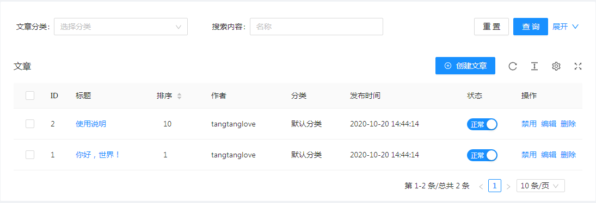
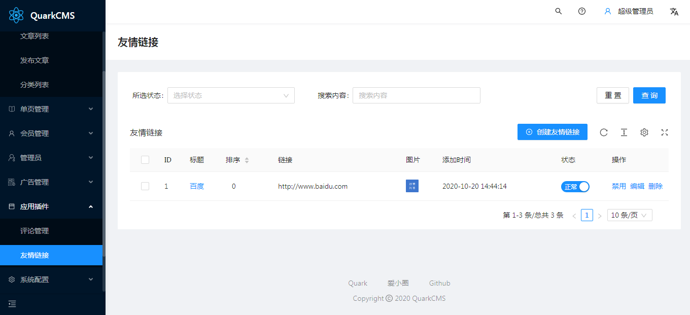
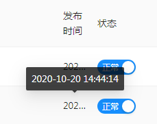
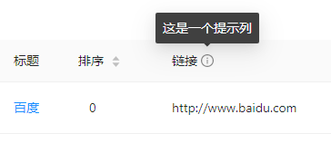

# 表格组件

## 简介
通过 QuarkAdmin 的 Table 组件您可以创建一个漂亮、简洁、功能齐全的列表页。每个 Table 组件都可以对应一个「模型」用来与该表交互。你可以通过模型查询数据表中的数据，以及对数据的增、删、改、查。

#### 效果预览


## 快速入门
QuarkAdmin 的各组件初始化相对比较统一，用法如下：
``` php
<?php

namespace App\Http\Controllers\Admin;

use App\Models\Link;
use Quark;
use QuarkCMS\QuarkAdmin\Http\Controllers\Controller;

class LinkController extends Controller
{
    protected function table()
    {
        $table = Quark::table(new Link)->title($this->title);
        ...
        return $table;
    }
}
```
在所有Table组件使用的文档里，示例控制器都应继承`QuarkCMS\QuarkAdmin\Http\Controllers\Controller`类，`$table` 是指 `Quark::table()` 得到的实例，这里就不在每个页面单独写了。

#### 下面我们正式开启Table组件的使用旅程：
第一步、首先我们先创建一张数据表，下面以友情链接（links）表为例：
``` sql
CREATE TABLE `links` (
  `id` int(10) unsigned NOT NULL AUTO_INCREMENT,
  `sort` int(11) DEFAULT '0',
  `title` varchar(255) COLLATE utf8mb4_unicode_ci NOT NULL COMMENT '标题',
  `url` varchar(255) COLLATE utf8mb4_unicode_ci NOT NULL COMMENT '访问地址',
  `cover_id` longtext COLLATE utf8mb4_unicode_ci COMMENT '封面图',
  `status` tinyint(1) NOT NULL DEFAULT '1',
  `created_at` timestamp NULL DEFAULT NULL,
  `updated_at` timestamp NULL DEFAULT NULL,
  PRIMARY KEY (`id`)
) ENGINE=InnoDB AUTO_INCREMENT=4 DEFAULT CHARSET=utf8mb4 COLLATE=utf8mb4_unicode_ci;
```

第二步、为对应的 links 数据表创建模型 `App\Models\Link` [示例代码](https://github.com/quarkcms/quark-cms/blob/master/app/Models/Link.php)

第三步、用下面的代码生成友情链接表links的列表页 [示例代码](https://github.com/quarkcms/quark-cms/blob/master/app/Http/Controllers/Admin/LinkController.php#L19)：
``` php
use App\Models\Link;
use Quark;

$table = Quark::table(new Link)->title($this->title);
$table->column('id','ID');
$table->column('title','标题')->editLink();
$table->column('sort','排序')->sorter()->editable()->width('80');
$table->column('url','链接');
$table->column('cover_id','图片')->image();
$table->column('created_at','添加时间');
$table->column('status','状态')->editable('switch',[
    'on'  => ['value' => 1, 'text' => '正常'],
    'off' => ['value' => 0, 'text' => '禁用']
])->width(100);

$table->model()->orderBy('sort', 'desc')->paginate(request('pageSize',10));
```
配置好相应的[路由]()、[菜单]()后，点开我们新添加的菜单就可以看到如下页面：



## 基本使用

### 初始化表格
你可以通过Quark门面快速实例化一个Table对象，如有必要你可以传入一个Model实例，来给表格组件绑定一个模型（注意：绑定模型并不是必须的，这取决于你是否使用了Table组件提供的增、删、改、查等行为操作）
``` php
Quark::table(new Link);
```

### 表格标题
可以通过`title()`方法来设置表格的标题
``` php
$table->title('友情链接');
```

### 配置工具栏


通过`options()`方法来控制表格的工具栏展示，设为 `false` 时不显示，工具栏默认设置为`[ 'fullScreen' => true, 'reload' => true ,'setting' => true ]`
``` php
// 不显示工具栏
$table->options(false);

// 不显示全屏
$table->options(['fullScreen' => false, 'reload' => true ,'setting' => true]);
```

### 设置Layout属性
表格元素的 `table-layout` 属性，设为 `fixed` 表示内容不会影响列的布局，参数：`'-'` | `'auto'` | `'fixed'`；

当列开启[自动缩略](#自动缩略) 时，需要设置 `tableLayout` 属性为 `'fixed'`;
``` php
$table->tableLayout('fixed');
```

### 列值为空时默认显示
通过`columnEmptyText()`方法来控制表格列值为空时的默认展示，默认设置为`'-'`
``` php
$table->columnEmptyText('空');
```

### 添加列
通过`column($attribute, $title)`方法来设置表格列的展示、字段绑定，参数`$attribute`为绑定的字段，`$title`为列的标题，更多关于列的操作可以查看下一节 [列的显示](#列的显示)：
``` php
$table->column('title', '标题');
```

### 表格数据
如果表格没有绑定模型的话，你可以通过`datasource()`方法来给表格填充数据
``` php
$data = [
  [
    'id' => 1,
    'name'=>'John Brown',
    'age'=> 32,
    'address'=> 'New York No. 1 Lake Park',
    'status'=>1,
  ],
  [
    'id' => 2,
    'name' => 'John Brown',
    'age'=> 32,
    'address' => 'New York No. 1 Lake Park',
    'status'=> 1,
  ]
]

$table->datasource($data);
```

## 列的显示
通过`column()`方法来设置列后，我们可以通过`column()`方法返回的实例，来控制列的不同展示：

### 列宽
通过`width()`方法来设置列的宽度
``` php
$table->column('sex','性别')->width(100);
```

### 对齐方式
可以用`align()`方法来设置列的对齐方式，可选 `'left'` | `'right'` | `'center'`，默认为：`'left'`
``` php
$table->column('sex','性别')->align('center');
```

### 固定列
通过`fixed()`方法来设置列是否固定（IE 下无效），可选 true (等效于 left) left right
``` php
$table->column('sex','性别')->fixed();
```

### 自动缩略
通过`ellipsis()`方法来控制列内容超出宽度后是否展示缩略，注意当设置自动缩略时需要设置 [tableLayout](#%E8%AE%BE%E7%BD%AElayout%E5%B1%9E%E6%80%A7) 属性为 `'fixed'`

``` php
$table->column('title','标题')->ellipsis();
```

### 支持复制
通过`copyable()`方法来控制列内容是否支持复制
``` php
$table->column('title','标题')->copyable();
```

### 列提示信息
通过`tooltip()`方法来设置提示一些信息


``` php
$table->column('url','链接')->tooltip('这是一个提示列');
```

### 重置列的数据显示
通过`display()`方法，我们可以重置列的数据显示
``` php
$table->column('sex','性别')->display(function ($sex) {
    if($sex == 1) {
        return '男';
    } else {
        return '女';
    }
});
```

### 内容映射
通过`using()`方法，我们可以根据每行数据列的值，来显示`using()`方法的参数中数组下标对应的值
``` php
$table->column('sex','性别')->using([1 => '男',2 => '女']);
```

### 链接
通过`link($href, $target)`方法来进行跳转操作；此方法有两个参数，`$href`为跳转的地址，`$target`为跳转方式 可选`'_blank'` | `'_self'` | `'_parent'` | `'_top'`，默认为`'_self'`；`$href`链接可以为前台地址，也可以为后台地址，我们可以借助`frontend_url($api ='',$isEngineUrl = true)`，`backend_url($api ='',$withToken = false)`两个助手函数分别生成前台、后台跳转链接
``` php
// 前台地址跳转
$table->column('title','标题')->link(frontend_url('admin/article/index'),'_blank');

// 替换参数的前台地址跳转
$table->column('title','标题')->link(frontend_url('admin/article/edit&id={id}'));

// 后台地址跳转，例如文件下载
$table->column('title','标题')->link(backend_url('admin/file/download',true),'_blank');

// 替换参数的后台地址跳转
$table->column('title','标题')->link(backend_url('admin/file/download&id={id}',true),'_blank');
```

### 编辑链接
通过`editLink($target)`方法来跳转到编辑页面；此方法有一个参数，`$target`为跳转方式 可选`'_blank'` | `'_self'` | `'_parent'` | `'_top'`，默认为`'_self'`
``` php
// 跳转到编辑页面
$table->column('title','标题')->editLink();

// 跳转到编辑页面，并在新窗口打开
$table->column('title','标题')->editLink('_blank');
```

### 二维码
通过下面的调用，会在这一列的每一行文字前面出现一个二维码icon，点击它可以展开一个小弹框，里面会显示这一列值的二维码编码图形
``` php
$table->column('link','二维码')->qrcode(); //qrcode($content=null,$width=150,$height=150)
```

### 显示图片
默认picture字段保存的是pictures表里面的id。
``` php
$table->column('picture','图片')->image();

//设置服务器和宽高
$table->column('picture')->image('http://xxx.com', 100, 100);
```

## 可筛选列
这个功能在表头给相应的列设置一个过滤器，可以更方便的根据这一列进行数据表格过滤操作：
``` php
$table->column('status', '状态')->filter([
    0 => '未知',
    1 => '已下单',
    2 => '已付款',
    3 => '已取消',
]);
```

## 可排序列
可排序列：
``` php
$table->column('status', '状态')->sorter();
```

## 可编辑列
数据表格有一系列方法，来帮助你列表里面直接对数据进行编辑；用editable方法，可以让你在表格中点击数据，在显示的对话框里面编辑保存数据，使用方法如下：

### 文本框控件（text）
``` php
$table->column('title', '标题')->editable();
```

### 下拉框控件（select）
第二个参数是select选择的选项
``` php
$table->column('title', '标题')->editable('select', [
    1 => 'option1',
    2 => 'option2',
    3 => 'option3'
]);
```

### 开关框架（switch）
快速将列变成开关组件，使用方法如下：
``` php
$table->column('status','状态')->editable('switch',[
    'on'  => ['value' => 1, 'text' => '正常'],
    'off' => ['value' => 0, 'text' => '禁用']
])->width(100);
```

## 行为列
用actions闭包函数，你可以自定义行操作；此方法传入两个参数，`$action`为Action对象的实例，关于Action的使用方法，你可以在下面 [表格行为](#表格行为) 一节中查看,`$row`为当前行的数组

### 快速入门
通过下面的代码你可以快速创建一个操作列：
``` php
$table->column('actions','操作')->width(260)->actions(function($action,$row) {

    // 根据不同的条件定义不同的A标签形式行为
    if($row['status'] === 1) {
        $action->a('禁用')
        ->withPopconfirm('确认要禁用数据吗？')
        ->model()
        ->where('id','{id}')
        ->update(['status'=>0]);
    } else {
        $action->a('启用')
        ->withPopconfirm('确认要启用数据吗？')
        ->model()
        ->where('id','{id}')
        ->update(['status'=>1]);
    }

    // 跳转默认编辑页面
    $action->a('编辑')->editLink();

    // 删除数据
    $action->a('删除')
    ->withPopconfirm('确认要删除吗？')
    ->model()
    ->where('id','{id}')
    ->delete();

    // 下拉菜单形式的行为
    $action->dropdown('更多')->overlay(function($action) use($row) {

        // 跳转详情页
        $action->item('详情')->showLink();

        // 弹框表单
        $action->item('充值')->modalForm(backend_url('api/admin/user/recharge?id='.$row['id']));
    });
});
```
## 表格行为
`$action` 为 `Action` 对象的实例，下面我们具体介绍一下表格行为的使用：

### 行为样式
现在表格行为暂时只提供 `A标签`、`按钮`、`下拉菜单` 形式的样式

#### A标签样式的行为
``` php
$action->a('禁用');
```

#### 按钮样式的行为
``` php
$action->button('编辑');
```

#### 下拉菜单形式的行为
``` php
$action->dropdown('更多');
```

### A标签行为

#### 跳转链接
::: danger
特别注意：当您设置了跳转链接，A标签将自动进行链接跳转，而不是执行行为操作！
:::
``` php

// 跳转一个网址
$action->a('跳转一个连接')
->href('http://www.ixiaoquan.com')
->target('_blank');

// 新页面打开一个网址
$action->a('跳转一个连接')->link('http://www.ixiaoquan.com','_blank');

// 应用内跳转，并传递参数
$action->a('编辑')->link(frontend_url('admin/article/edit&id={id}'));

// 新页面打开一个接口网址，并带上token
$action->a('下载文件')->link(backend_url('admin/file/download',true),'_blank');
```

#### 跳转到新增页面
``` php
// 打开新增页面
$action->a('跳转一个连接')->createLink();

// 新页面打开新增页面
$action->a('跳转一个连接')->createLink('_blank');
```

#### 跳转到编辑页面
``` php
// 打开编辑页面
$action->a('跳转一个连接')->editLink();

// 新页面打开编辑页面
$action->a('跳转一个连接')->editLink('_blank');
```

#### 跳转到详情页面
``` php
// 打开详情页面
$action->a('跳转一个连接')->showLink();

// 新页面打开详情页面
$action->a('跳转一个连接')->showLink('_blank');
```

#### 带Pop确认
``` php
$action->a('删除')->withPopconfirm('确认要删除吗？');
```

#### 带弹框确认
``` php
$action->a('删除')->withConfirm('确认要删除吗？','删除后数据将无法恢复，请谨慎操作！');
```

#### 打开弹框表单
注意：如果您要打开弹窗表单，需要在相应的接口返回表单渲染数据 [示例代码](https://github.com/quarkcms/quark-cms/blob/master/app/Http/Controllers/Admin/UserController.php#L65)
``` php
$action->a('编辑')->modalForm(backend_url('api/admin/config/edit?id=1'));
```

#### 打开抽屉表单
注意：如果您要打开抽屉表单，需要在相应的接口返回表单渲染数据 [示例代码](https://github.com/quarkcms/quark-cms/blob/master/app/Http/Controllers/Admin/NavigationController.php#L50)
``` php
$action->a('编辑')->drawerForm(backend_url('api/admin/menu/edit?id=1'));
```

#### 行为执行接口
在没有设置链接跳转的情况下，点击事件将自动触发对接口的访问，您可以通过`api`方法自定义访问接口，在默认的情况下访问当前控制器的`'api/admin/.../action'`接口
::: danger
特别注意：当您设置了跳转链接，将无法触发对接口的访问请求！
:::
``` php

// 当链接被点击时，会触发对接口的get访问请求
$action->a('删除')->api('api/admin/menu/delete?id=1');
```

#### 行为操作数据
您可以通过`model`方法，对数据进行管理，当前台触发对`'api/admin/.../action'`接口访问的时候，会对`model`方法进行回调，支持Laravel 提供的Eloquent ORM 来操作各种数据库数据
::: danger
特别注意：行操作、批量操作、工具栏操作的行为在参数替换的使用方法上会有些许不同，一定要注意！避免不必要的风险！
:::

``` php

// 删除全部数据
$action->a('删除')
->model()
->delete();

// 在回调的时候对id进行参数替换，执行带有where条件的操作
$action->a('禁用')
->model()
->where('id','{id}')
->update(['status'=>0]);
```

### 按钮行为

#### 按钮行为样式
按钮行为提供了一些样式配置

``` php
// 将按钮宽度调整为其父宽度
$action->button('这是一个按钮')->block();

// 设置危险按钮
$action->button('这是一个按钮')->danger();

// 按钮失效状态
$action->button('这是一个按钮')->disabled();

// 幽灵属性，使按钮背景透明
$action->button('这是一个按钮')->ghost();

// 设置按钮图标
$action->button('这是一个按钮')->icon('plus-circle');

// 设置按钮形状，可选值为 circle、 round 或者不设
$action->button('这是一个按钮')->shape('circle');

// 设置按钮类型，primary | ghost | dashed | link | text | default
$action->button('这是一个按钮')->type('primary');

// 设置按钮类型为primary并且为危险按钮
$action->button('这是一个按钮')->type('primary',true);

// 设置按钮大小，large | middle | small | default
$action->button('这是一个按钮')->size('small');
```

#### 按钮行为其他用法
按钮行为的 [跳转链接](#跳转链接)、[跳转到新增页面](#跳转到新增页面)、[跳转到编辑页面](#跳转到编辑页面)、[跳转到详情页面](#跳转到详情页面)、[带Pop确认](#带Pop确认)、[带弹框确认](#带弹框确认)、[打开弹框表单](#打开弹框表单)、[打开抽屉表单](#打开抽屉表单)、[行为执行接口](#行为执行接口)、[行为操作数据](#行为操作数据) 等用法与A标签的一样，可以点击相应章节查看，下面是一个简单的示例：
``` php
// 跳转一个网址
$action->button('跳转一个连接')
->href('http://www.ixiaoquan.com')
->target('_blank');
```

### 下拉菜单行为
#### 快速入门
``` php
$action->dropdown('更多')->overlay(function($action) {
    $action->item('禁用用户')
    ->withConfirm('确认要禁用吗？','禁用后管理员将无法登陆后台，请谨慎操作！')
    ->model()
    ->whereIn('id','{ids}')
    ->update(['status'=>0]);

    $action->item('启用用户')
    ->withConfirm('确认要启用吗？','启用后管理员将可以正常登录后台！')
    ->model()
    ->whereIn('id','{ids}')
    ->update(['status'=>1]);
});
```

#### 下拉框显示模式
下拉框显示模式,a|button
``` php
// A标签样式的下拉菜单
$action->dropdown('更多')->mode('a');

// 按钮样式的下拉菜单
$action->dropdown('更多')->mode('button');
```

#### 下拉框箭头
下拉框箭头是否显示
``` php
$action->dropdown('更多')->arrow();
```

#### 菜单是否禁用
``` php
$action->dropdown('更多')->disabled();
```

#### 下拉框的菜单
``` php
// 下拉菜单形式的行为
$action->dropdown('更多')->overlay(function($action) {
    $action->item('禁用')
    ->withConfirm('确认要禁用吗？','禁用后将无法使用，请谨慎操作！')
    ->model()
    ->whereIn('id','{ids}')
    ->update(['status'=>0]);

    $action->item('启用')
    ->withConfirm('确认要启用吗？','启用后可以正常使用！')
    ->model()
    ->whereIn('id','{ids}')
    ->update(['status'=>1]);
});
```

#### 菜单弹出位置
菜单弹出位置：bottomLeft bottomCenter bottomRight topLeft topCenter topRight
``` php
$action->dropdown('更多')->placement('bottomLeft');
```

#### 触发下拉的行为
触发下拉的行为, 移动端不支持 hover
``` php
$action->dropdown('更多')->trigger('hover');
```

#### 下拉框菜单行为
下拉框的菜单项触发的行为与A标签的一样，具体用法请查看相应的章节： [跳转链接](#跳转链接)、[跳转到新增页面](#跳转到新增页面)、[跳转到编辑页面](#跳转到编辑页面)、[跳转到详情页面](#跳转到详情页面)、[带Pop确认](#带Pop确认)、[带弹框确认](#带弹框确认)、[打开弹框表单](#打开弹框表单)、[打开抽屉表单](#打开抽屉表单)、[行为执行接口](#行为执行接口)、[行为操作数据](#行为操作数据)

## 数据查询
如果在实例化表格对象时绑定了模型，你可以使用 Laravel 提供的Eloquent ORM 来操作各种数据库数据。

### 快速入门
默认情况下，表格的数据没有任何查询条件，可以使用model()方法来给当前表格数据添加查询条件：
``` php
$table->model()->where('id', '>', 100);

$table->model()->whereIn('id', [1, 2, 3]);

$table->model()->whereBetween('votes', [1, 100]);

$table->model()->whereColumn('updated_at', '>', 'created_at');

$table->model()->orderBy('id', 'desc');

$table->model()->take(100);
```
$table->model()后面可以直接调用Eloquent的查询方法来给表格数据添加查询条件，更多查询方法参考Laravel文档.

### 设置分页
``` php
// 默认为每页10条
$table->paginate(15);

// 根据传参，动态设置每页数量
$table->paginate(request('pageSize',10));
```

### 关联模型
一对一，users表和profiles表通过profiles.user_id字段生成一对一关联
``` sql
users
    id      - integer 
    name    - string
    email   - string

profiles
    id      - integer 
    user_id - integer 
    age     - string
    gender  - string
```

对应的数据模分别为:
``` php
class User extends Model
{
    public function profile()
    {
        return $this->hasOne(Profile::class);
    }
}

class Profile extends Model
{
    public function user()
    {
        return $this->belongsTo(User::class);
    }
}
```

通过下面的代码可以关联在一个table里面:
``` php
$table = new table(new User);

$table->column('profile.gender');
```

## 搜索栏
Table组件提供了一系列的方法来实现对表格搜索栏的渲染

#### 效果预览


### 快速入门
通过`search()`闭包函数我们可以快速的构建表格页面的查询表单项，下面是一个简单的例子：
``` php
$table->search(function($search) {

    $search->where('title', '搜索内容',function ($query) {
        $query->where('title', 'like', "%{input}%");
    })->placeholder('搜索内容');

    $search->equal('status', '所选状态')
    ->select([''=>'全部',1=>'正常',2=>'已禁用'])
    ->placeholder('选择状态')
    ->width(110);

    $search->between('created_at', '发布时间')
    ->datetime();
});
```

### 展开搜索栏
通过点击筛选按钮展开显示，默认是不展开的，用下面的方式可以让它默认展开
``` php
// 在`$table`返回的search实例上操作
$table->search(function($search) {
    // ...
})->collapsed(true);
```

### Label 标签对齐方式
Label 标签的文本对齐方式，`'left'` | `'right'`
``` php
// 在`$table`返回的search实例上操作
$table->search(function($search) {
    // ...
})->labelAlign('left');
```

### 设置字段组件的尺寸
设置字段组件的尺寸,`'small'` | `'middle'` | '`large'`
``` php
// 在`$table`返回的search实例上操作
$table->search(function($search) {
    // ...
})->size('small');
```

### 显示表单控件数量
自定义折叠状态下默认显示的表单控件数量，没有设置或小于 0，则显示一行控件; 数量大于等于控件数量则隐藏展开按钮
``` php
// 在`$table`返回的search实例上操作
$table->search(function($search) {
    // ...
})->defaultColsNumber(2);
```

### Label 宽度
表单 Label 宽度,number | `'auto'`
``` php
// 在`$table`返回的search实例上操作
$table->search(function($search) {
    // ...
})->labelWidth(200);
```

### 表单项宽度
表单项宽度,number[0 - 24]
``` php
// 在`$table`返回的search实例上操作
$table->search(function($search) {
    // ...
})->span(0);
```

### 是否有分割线
每一行是否有分割线
``` php
// 在`$table`返回的search实例上操作
$table->search(function($search) {
    // ...
})->split();
```

### 范围查询
可以把你最常用的查询定义为一个查询范围，它将会出现在筛选按钮的下拉菜单中，下面是几个例子：
``` php
$search->scope('male', '男性')->where('gender', 'm');

// 多条件查询
$search->scope('new', '最近修改')
    ->whereDate('created_at', date('Y-m-d'))
    ->orWhere('updated_at', date('Y-m-d'));

// 关联关系查询
$search->scope('address')->whereHas('profile', function ($query) {
    $query->whereNotNull('address');
});

$search->scope('trashed', '被软删除的数据')->onlyTrashed();
```
::: tip
scope方法可以链式调用任何eloquent查询条件
:::

### 查询类型

目前支持的过滤类型有下面这些：

#### 等于条件（equal）
SQL语句：`... WHERE column = "$input"`
``` php
$search->equal('column', $label);
```

#### 不等于条件（not equal）
SQL语句：`... WHERE column != "$input"`
``` php
$search->notEqual('column', $label);
```

#### 模糊查询（like）
SQL语句：`... WHERE column LIKE "%$input%"`
``` php
$search->like('column', $label);
```

#### 大于条件（gt）
SQL语句：`... WHERE column > "$input"`
``` php
$search->gt('column', $label);
```

#### 小于条件（lt）
SQL语句：`... WHERE column < "$input"`
``` php
$search->lt('column', $label);
```

#### 区间查询（between）
SQL语句：`... WHERE column BETWEEN "$start" AND "$end"`
``` php
$search->between('column', $label);

// datetime类型控件
$search->between('column', $label)->datetime();
```

#### 范围查询（in）
SQL语句：`... WHERE column in (...$inputs)`
``` php
// 多选下拉框类型控件
$search->in('column', $label)->multipleSelect(['key' => 'value']);
```

#### 非范围查询（notIn）
SQL语句：`... WHERE column not in (...$inputs)`
``` php
// 多选下拉框类型控件
$search->notIn('column', $label)->multipleSelect(['key' => 'value']);
```

#### 复杂查询（where）
可以用where来构建比较复杂的查询过滤

SQL语句：`... WHERE title LIKE "%$input" OR content LIKE "%$input"`
``` php
$search->where(function ($query) {

    $query->where('title', 'like', "%{input}%")
        ->orWhere('content', 'like', "%{input}%");

}, 'Text');
```

SQL语句：`... WHERE rate>= 6 AND created_at= {$input}`
``` php
$search->where(function ($query) {

    $query->whereRaw("`rate` >= 6 AND `created_at` = %{input}%");

}, 'Text');
```

关系查询，查询对应关系profile的字段：
``` php
$search->where(function ($query) {

    $query->whereHas('profile', function ($query) {
        $query->where('address', 'like', "%{input}%")->orWhere('email', 'like', "%{input}%");
    });

}, '地址或手机号');
```

### 控件类型

#### 文本框控件（text）
表单类型默认是text input，可以设置placeholder：
``` php
$search->equal('column')->placeholder('请输入。。。');
```

#### 下拉框控件（select）
``` php
$search->equal('column')->select(['key' => 'value'...]);
```

#### 多选下拉框控件（multipleSelect）
一般用来配合in和notIn两个需要查询数组的查询类型使用，也可以在where类型的查询中使用：
``` php
$search->in('column')->multipleSelect(['key' => 'value'...]);
```

#### 时间选择控件（datetime）
``` php
$search->equal('column')->datetime();
```
#### 高级控件
有时候对同一个字段要设置多中筛选方式，可以通过下面的方式实现
``` php
$search->group('rate', function ($group) {
    $group->gt('大于');
    $group->lt('小于');
    $group->nlt('不小于');
    $group->ngt('不大于');
    $group->equal('等于');
});
```
有下面的几个方法可以调用
``` php
// 等于
$group->equal();

// 不等于
$group->notEqual();

// 大于
$group->gt();

// 小于
$group->lt();

// 大于等于
$group->nlt();

// 小于等于
$group->ngt();

// 匹配
$group->match();

// 复杂条件
$group->where();

// like查询
$group->like();
```

## 批量操作
用batchActions闭包函数，你可以自定义批量操作；此方法传入`$action`参数，`$action`为Action对象的实例，关于Action的使用方法，你可以在 [表格行为](#表格行为) 一节中查看
::: danger
特别注意：批量操作的行为在参数替换的方法上使用的是`'{ids}'`字符串，一定要注意！避免不必要的风险！
:::
``` php
$table->batchActions(function($action) {
    // 跳转默认编辑页面
    $action->a('批量删除')
    ->withConfirm('确认要删除吗？','删除后数据将无法恢复，请谨慎操作！')
    ->model()
    ->whereIn('id','{ids}')
    ->delete();

    // 下拉菜单形式的行为
    $action->dropdown('更多')->overlay(function($action) {
        $action->item('禁用菜单')
        ->withConfirm('确认要禁用吗？','禁用后菜单将无法使用，请谨慎操作！')
        ->model()
        ->whereIn('id','{ids}')
        ->update(['status'=>0]);

        $action->item('启用菜单')
        ->withConfirm('确认要启用吗？','启用后菜单可以正常使用！')
        ->model()
        ->whereIn('id','{ids}')
        ->update(['status'=>1]);
    });
});
```

## 工具栏
目前工具栏只支持行为的配置
### 工具栏行为
用actions闭包函数，你可以自定义工具栏上的操作；此方法传入`$action`参数，`$action`为Action对象的实例，关于Action的使用方法，你可以在 [表格行为](#表格行为) 一节中查看
::: danger
特别注意：工具栏上的行为并不会进行任何形式的参数替换！
:::
``` php
$table->toolBar()->actions(function($action) {
    // 跳转默认创建页面
    $action->button('创建菜单')
    ->type('primary')
    ->icon('plus-circle')
    ->drawerForm(backend_url('api/admin/menu/create'));
});
```